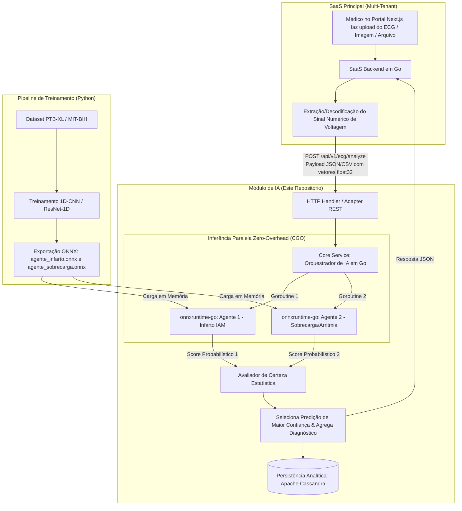

# 🫀 Módulo de IA Multi-Agente para Análise de ECG (Open Health SaaS)

> **Projeto de Conclusão de Curso (TCC)** — *Módulo Específico de Inteligência Artificial*  
> Microserviço de alta performance para suporte à decisão clínica em Eletrocardiogramas (ECG), utilizando **1D-CNN (PyTorch/tsai)** exportadas para **ONNX** e inferência nativa em **Go (Golang)** com arquitetura Hexagonal.

---

## 📌 1. Visão Geral da Arquitetura e Integração SaaS

Este repositório é dedicado **exclusivamente ao Módulo e Engine de Inteligência Artificial**. Ele funciona como um microserviço autônomo dentro de um ecossistema **Open Health SaaS Multi-tenant** (com orquestração global em Go, persistência em MariaDB e Apache Cassandra, e infraestrutura AWS provisionada via Terraform).

### Fluxo Completo de Integração de Dados



> ⚠️ **Restrição Técnica Fundamental**: O Pipeline de IA opera **exclusivamente com vetores numéricos de séries temporais de sinal de voltagem (`float32[]`)**. Qualquer conversão de imagens ou arquivos brutos de exames é realizada a montante pelo SaaS Principal antes da requisição de inferência.

---

## 🏗️ 2. Estrutura de Pastas (Arquitetura Hexagonal em Go)

```text
inteligencia_artificial_para_analise_e_estudo_de_eletrocardiograma/
├── TODOs_List.md                        # Checklist de acompanhamento do projeto
├── treinamento.md                       # Passo a passo completo de treinamento no Google Colab
├── docker-compose.yml                   # Orquestração local (Go Backend + Cassandra)
├── README.md
│
├── ml_pipeline/                         # [PYTHON] Treinamento & Exportação ONNX
│   ├── data/                            # Scripts de pré-processamento do PTB-XL/MIT-BIH
│   │   └── preprocess.py                # Filtragem, normalização e amostragem 1D (1000 pt/canal)
│   ├── models/                          # Arquiteturas de Redes Convolucionais Unidimensionais
│   │   └── resnet1d.py                  # 1D-CNN com PyTorch + tsai
│   ├── export/                          # Scripts de exportação ONNX
│   │   └── export_onnx.py               # torch.onnx.export()
│   ├── export_dummy_onnx.py             # Script utilitário para gerar modelos stubs de teste
│   ├── train_infarto.py                 # Script de treino do Agente 1 (Infarto)
│   ├── train_sobrecarga.py              # Script de treino do Agente 2 (Sobrecarga/Arritmia)
│   └── requirements.txt
│
└── backend_go/                          # [GO] Engine de Inferência Hexagonal
    ├── cmd/
    │   └── server/
    │       └── main.go                  # Entry point da aplicação Go
    ├── internal/
    │   ├── core/                        # Núcleo de Domínio e Regras de Negócio
    │   │   ├── domain/                  # Entidades, Enums e Erros de Domínio
    │   │   │   ├── ecg_signal.go        # Structs do Sinal float32 e Multi-tenancy
    │   │   │   ├── analysis_result.go   # Structs do resultado diagnósticos
    │   │   │   └── errors.go            # Definição de erros idiomáticos
    │   │   ├── ports/                   # Interfaces (Ports) do Sistema
    │   │   │   └── ports.go             # Interfaces Predictor, Repository e Orchestrator
    │   │   └── services/                # Regras de Negócio e Comparador Probabilístico
    │   │       └── orchestrator_service.go # Execução concorrente via Goroutines
    │   │
    │   └── adapters/                    # Adaptadores de Entrada/Saída
    │       ├── http/                    # Handlers REST (Gin)
    │       │   └── ecg_handler.go       # POST /api/v1/ecg/analyze
    │       ├── onnx/                    # Adaptador do Runtime CGO (onnxruntime-go)
    │       │   └── onnx_engine.go       # Gerenciador de Sessões ONNX com Fallback
    │       └── storage/                 # Adaptador do Apache Cassandra
    │           └── cassandra_repository.go
    │
    ├── models_onnx/                     # Artefatos Binários dos Modelos Treinados (.onnx)
    │   ├── agente_infarto.onnx
    │   └── agente_sobrecarga.onnx
    ├── go.mod
    └── Dockerfile                       # Dockerfile multinível contendo CGO + libonnxruntime.so
```

---

## ⚡ 3. Multi-Agentes de IA e Orquestrador de Decisão

O pipeline executa dois modelos especialistas treinados de forma paralela via **Goroutines**:

1. **Agente 1 — Infarto Agudo do Miocárdio (IAM)**: Modelo especialista em padrões morfológicos de supra/infradesnivelamento de segmento ST e inversão de onda T.
2. **Agente 2 — Sobrecarga / Condução / Arritmia**: Modelo especialista em bloqueios de ramo, hipertrofias ventriculares e alteração de intervalos de condução elétrica (QRS/QT).

Ambos os agentes processam o sinal `[]float32` simultaneamente. O serviço em Go compara os scores probabilísticos de saída e seleciona o agente de **maior nível de certeza estatística**.

---

## 🐳 4. Execução e Testes via Docker Container

Para executar e testar o microserviço de IA localmente com o banco Apache Cassandra containerizado:

### 1. Subir os Containers via Docker Compose
```bash
docker-compose up --build
```
Isso compilará a aplicação em Go com CGO e a biblioteca `libonnxruntime.so`, subindo o servidor HTTP na porta `8080` e o Apache Cassandra na porta `9042`.

### 2. Testando a API de Inferência (POST `/api/v1/ecg/analyze`)

Você pode enviar um teste via `curl` ou Postman simulando uma chamada vinda de um tenant do SaaS:

```bash
curl -X POST http://localhost:8080/api/v1/ecg/analyze \
  -H "Content-Type: application/json" \
  -d '{
    "tenant_id": "tenant-clinica-alfa",
    "patient_id": "PAC-98421",
    "sampling_rate_hz": 500,
    "leads": {
      "lead_II": [0.012, 0.015, 0.045, 0.120, 0.850, 0.210, -0.150, 0.020, 1.850]
    }
  }'
```

#### Resposta Esperada (200 OK):
```json
{
  "status": "success",
  "data": {
    "analysis_id": "8f2a1b9e-...",
    "tenant_id": "tenant-clinica-alfa",
    "patient_id": "PAC-98421",
    "primary_diagnosis": "Suspeita de Infarto Agudo do Miocárdio (IAM)",
    "winning_agent": "Agente 1 - Infarto Agudo do Miocárdio",
    "highest_confidence": 0.94,
    "detailed_scores": {
      "Agente 1 - Infarto Agudo do Miocárdio": {
        "agent_name": "Agente 1 - Infarto Agudo do Miocárdio",
        "diagnosis": "Suspeita de Infarto Agudo do Miocárdio (IAM)",
        "confidence": 0.94
      },
      "Agente 2 - Sobrecarga/Arritmia": {
        "agent_name": "Agente 2 - Sobrecarga/Arritmia",
        "diagnosis": "Alteração de Condução / Sobrecarga Ventricular",
        "confidence": 0.85
      }
    },
    "processed_points": 1000,
    "execution_time_ms": 3,
    "timestamp": "2026-07-21T02:55:00Z"
  }
}
```

---

## 🧠 5. Como Treinar os Modelos em Nuvem (Google Colab)

Para o guia detalhado de treinamento da 1D-CNN no dataset PTB-XL usando GPU gratuita e como exportar os arquivos `.onnx`, consulte o documento dedicado:
📖 **[treinamento.md](file:///d:/repos/pohinc/inteligencia_artificial_para_analise_e_estudo_de_eletrocardiograma/treinamento.md)**

---

## 📅 6. Cronograma de Emergência (Até 01/10)

| Período | Foco Principal | Entregáveis Específicos |
| :--- | :--- | :--- |
| **Julho (Sem. 1 e 2)** | **Pipeline ML (Python)** | - Download e filtragem dos dados do PTB-XL.<br>- Treinamento dos modelos 1D-CNN (IAM e Sobrecarga).<br>- Exportação para `agente_infarto.onnx` e `agente_sobrecarga.onnx`.<br>- Coleta dos gráficos AUC-ROC para o TCC. |
| **Julho (Sem. 3 e 4)** | **Core Engine (Go + CGO)** | - Arquitetura Hexagonal em Go (`domain`, `ports`, `services`, `adapters`).<br>- Carregamento ONNX via `onnxruntime-go`.<br>- Parsing e Z-Score scaling de vetores `[]float32`. |
| **Agosto** | **Concorrência & Cassandra** | - Orquestrador paralelo com `goroutines` e seleção probabilística.<br>- Persistência no Apache Cassandra. |
| **Setembro** | **Validação & Monografia** | - Testes de estresse na AWS.<br>- Avaliação de usabilidade instrumental (Questionário SUS).<br>- Escrita e formatação final da monografia. |